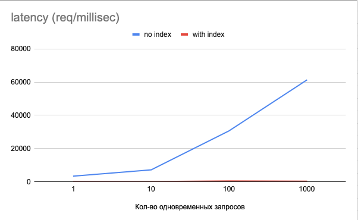
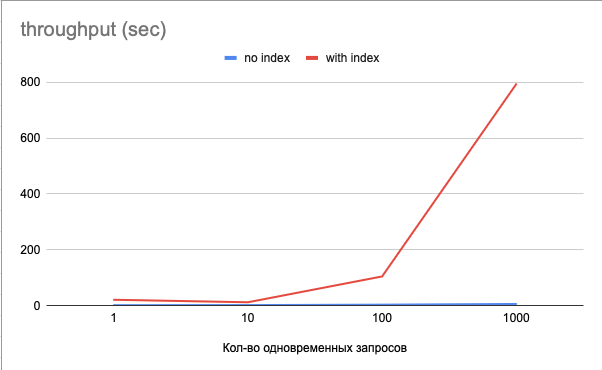

# Домашнее задание "Производительность индексов"

## Цель:
В результате выполнения ДЗ вы создадите набор тестовых данных для проведения нагрузочного тестирования, подберете наиболее подходящие индексы и проведете тесты производительности.

## Описание/Пошаговая инструкция выполнения домашнего задания:

- Сгенерировать любым способ 1,000,000 анкет. Имена и Фамилии должны быть реальными (чтобы учитывать селективность индекса)
- Реализовать функционал поиска анкет по префиксу имени и фамилии (одновременно) в вашей социальной сети (запрос в форме firstName LIKE ? and secondName LIKE ?). Сортировать вывод по id анкеты. Использовать InnoDB движок.
- Провести нагрузочные тесты по этой странице. Поиграть с количеством одновременных запросов. 1/10/100/1000.
- Построить графики и сохранить их в отчет
- Сделать подходящий индекс.
- Повторить пункт 3 и 4.

В качестве результата предоставить отчет в котором должны быть:

- графики latency до индекса;
- графики throughput до индекса;
- графики latency после индекса;
- графики throughput после индекса;
- запрос добавления индекса;
- explain запросов после индекса;
- объяснение почему индекс именно такой;

## Отчет

### Графики latency



### Графики throughput



### Запрос добавления индекса
```
CREATE INDEX idx_users_lastname_firstname USING BTREE ON users (last_name, first_name);
```

Запрос на поиск:

```SELECT id, first_name, last_name, age, gender, city_id, interests
FROM users
WHERE first_name LIKE 'андр%' AND last_name LIKE 'андр%'
ORDER BY id LIMIT 50
```

URL для поиска через API:
```
http://localhost:8080/api/v1/users/filter?fNamePrefix=Але&lNamePrefix=Игн
```

### explain запросов после индекса

| id | select\_type | table | partitions | type | possible\_keys | key | key\_len | ref | rows | filtered | Extra |
| :--- | :--- | :--- | :--- | :--- | :--- | :--- | :--- | :--- | :--- | :--- | :--- |
| 1 | SIMPLE | users | NULL | index | idx\_users\_lastname\_firstname | PRIMARY | 8 | NULL | 513 | 1.08 | Using where |


### Объяснение почему индекс именно такой

Исходя из требований, а именно условия И (AND) при проверке условий по полям Имя и Фамилия, кажется логичным 
использовать в данном случае составной индекс по двум полям, по которым происходит поиск. Так же, в данном случае,
свою роль играет селективность полей в индексе. В данном случае, селективность поля с фамилией выше (кол-во уникальных
записей больше), поэтому первым полем в индексе выбрана фамилия. 

### Способ создания нагрузки

Тестовые данные сгенерированы из 2 файлов с Именами и Фамилиями на кириллице, подбирая пары в случайном порядке.

Для сохжания нагрузки на сервис и получения статистики использовалась утилита JMeter. Скрипт с простейшим сценарием 
доступен в [файле](load-scenario.jmx)

### Выводы:

Добавление индекса положительно сказалось как на время ожидания ответа, так и на проускную способность сервера.

К сожалению, при реализации сценария с 1000 одновременных запросов и отсутсивем индекса, ресурсов сервиса не хватило на 
успешную обработку всех запросов и некоторый процент из них не возвращал 200 HTTP-код в основном из-за дефолтных настроек
таймаутов, которых не хватало для получения ответа. Поэтому реальная пропускная способность веротяно была бы ниже,
тк полученная пропускная способность включает в себя ответы с ошибками обработки запроса.