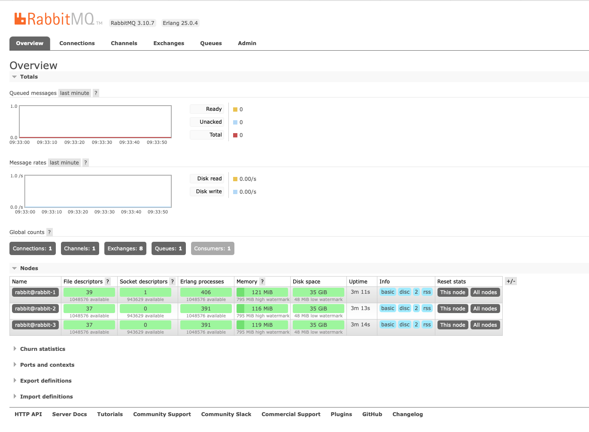
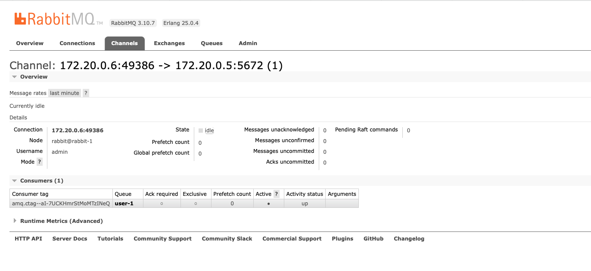

# Онлайн обновление ленты новостей

## Цель:
Разработать компонент, куда будет подключаться клиент при открытии страницы ленты. Сервис должен слушать очередь обновлений ленты. При получении подписанным клиентом сообщения, отправлять его в браузер по WebSocket. Учесть возможность масштабирования сервиса. То есть сообщение должно доставляться только на тот экземпляр компонента, куда соединен клиент. Для этого можно использовать, например Routing Key из Rabbitmq.
ДЗ принимается в виде исходного кода на github, документации по архитектуре и демонстрации работоспособности развернутого в интернете приложения.

## Критерии оценки:
Оценка происходит по принципу зачет/незачет.

Требования:
- При добавлении поста у друга, лента должна обновляться автоматически (с небольшой задержкой).
- Корректная работа сервиса вебсокетов.
- Линейная масштабируемость сервиса вебсокетов.
- Описан процесс масштабирования RabbitMQ.

## описание реализации

В предыдущем домашнем задании была реализована рассылка обновлений при помощи подписки на очереди в RabbitMQ.
В рамках данной работы эта реализация была расширена для возможности автоматического обновления ленты новостей на стороне 
клиента. 

Реализовано это путем испольщоавния websocket'ов. В данном случае, клиент (браузер) при открытии страницы с лентой новостей
инициирует открытие соединения с бэкенд-сервером по websocket'у. Данное соедние остается активным все время пока открыта 
страница с лентой новостей. При этом клиент, после открытия сокета, передает на бэкенд свой идентификатор, благодаря чему 
на стороне бэкенда данное подключение может быть идентифицировано. (если бы использовались STOMP то можно было бы 
переиспользовать стандартный механизм аутентификации и получать идентификатор клиента из контекст-безопасности) Сами же 
подключения на бэкенде сохраняются в коллекции из которой можно выбрать подключение для конкретного клиента.

Далее, при получении слушателем очереди RabbitMQ сообщения о новости, эта новость добавляется в кэш новостей по ключу 
routingKey (является идентификатором пользователя, которому данное сообщение предназначается), после помещения новости в 
кэш ищется в коллекции открытых сокетов соединение для этого пользователя и в него отправляется специально сообщение о
поступлении новых новостей.

На стороне страницы в браузере встроен cкрипт, который при получении сообщения в открытий вебсокет иницаилизирует 
частичное обновление данных страниц с новостями и тем самым выводит новые сообщения пользователю. Тут на самом деле 
лучше было бы через вебсокеты передавать не сообщение об обновлении, но саму новость и дополнять модель страницы этой 
новостью, но тк на фронте используется Thymleaf и из-за дефицита оыпта с фронтом, сейчас получение сообщения вызывает
частичное обновление модели MVC, что более затратно по времени и ресурсам.

## Создание кластера RabbitMQ

В [docker-compose](docker-compose.yml) к данному ДЗ реализован декларативный способ запуска кластера серверов RabbitMQ

Реализация требует следующих шагов:

* сгенерировать специальный токен (ERLANG_COOKIE), который в дальнейшем распространяется на все сервисы, которые будут 
составлять кластер. В нашем случае это переменная окружения RABBITMQ_ERLANG_COOKIE
* сделать единый для всех сервисов [конфигурационный файл](./rabbit/r-conf-1/rabbitmq.conf) и подключить его к контейнеру через расшаренную папку на хосте

После запуска всех сервисов мы можем проверить через админ консоль количество узлов составляющих кластер:

После запуска сервера с приложением и авторизации пользователем создается канал на одной из нод:

по умолчанию в кластере созданным выше реплизируется только служебная информация, сами очереди не реплицируются. 
Для репликации так же и очередей требуется дополнительно настраивать сервисы включая соответствующий плагин. В нашем случае,
репликация очередей кажется избыточной тк очереди в данном случае короткоживущие и требуются только для отправки обновлений
и при отказе узла потеря хранимых на нем очередей не будет болезненной - поэтому репликацию очередей в примере выше не делал.